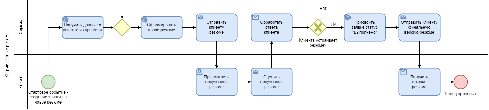

# EngeneeringRequirements-2023

## 2 Краткое описание продукта:

__Назначение:__ Создание профиля с информацией о профессиональных навыках, умениях и достижениях, который можно использовать для создания резюме различных форматов и под разнообразные платформы поиска вакансий.

__Цель__: ускорить процесс создания и подачи профессионального резюме для соискателя работы

__Основные функции__: 
* Заполнение профиля как вручную, так и с помощью различных уже созданных аккаунтов посредством API
* Конвертация необходимой части профиля в различные форматы
* Интеграция с платформами для поиска вакансий и платформами, где необходимы профессиональные данные

### Интервью:

_Аналитик:_ Какие функции важны? 
_Заказчик:_ Пользователю нужно позволить создавать резюме, давать доступ к резюме работодателям, экспортировать на сайты агрегаторы

_Аналитик:_ Каких клиентов нам нужно поддерживать? 
_Заказчик:_ Нужна поддержка Desktop-версии

_Аналитик:_ Сколько у нас планируется ежемесячных пользователей? 
_Заказчик:_ 10 000

_Аналитик:_ Сколько раз пользователь обычно посещает сайт? 
_Заказчик:_ Если создает резюме с нуля, то может редактировать хоть каждый день, в будущем достаточно заходить раз в месяц, чтобы актуализировать информацию.

_Аналитик:_ Нужно ли нам поддерживать международных пользователей? 
_Заказчик:_ Поддержка возможна, т.к. резюме нужно составлять по всему миру, но на текущий момент в качестве MVP достаточно поддержки только для российских пользователей.

_Аналитик:_ Какие форматы резюме поддерживаются? 
_Заказчик:_ Возможность создать индивидуальное резюме, а также оптимизировать их с сайтов-агрегаторов.

_Аналитик:_ Требуется ли авторизация через различные сервисы? 
_Заказчик:_ Да, для пользователя это было бы удобно

_Аналитик:_ Какие-либо требования к формату резюме? 
_Заказчик:_ Я считаю, что должны быть следующие разделы в обязательном порядке: образование, карьера, навыки, достижения, общая информация.

## 3 Функциональные требования

### 3.1 BPMN-диаграмма:

### User Story:

__Вопросы:__

* Что это за пользователь?
*	Какое действие он хочет выполнить в продукте или какой результат от продукта хочет получить?
*	Зачем это ему?

__Ответы:__

* Как соискатель сайта по созданию резюме, я хочу формировать релевантное резюме, которое будет визуально привлекательным, содержательным и информативным, а также поможет пройти собеседование и получить приглашение на работу.

* Как администратор сайта, я могу редактировать оформление сайта, создавать шаблоны для резюме, реализовать новые способы регистрации пользователя и экспорта файлов, что поможет повысить рейтинг сайта и исполнителя, которым является администратор, а также при платной версии поможет заработать деньги.

__Функционал:__
*	Получить данные о клиенте из профиля
*	Сформировать и отправить клиенту резюме
*	Регистрация и авторизация пользователей
*	Дополнение профиля данными
*	Экспорт в различные форматы (PDF, PNG)
*	Экспорт в сайты агрегаторы

### 3.2 Customer Journey Map:

### 3.3 Прототипы интерфейсов в Figma:

#### Main page

#### My summaries

#### New summary

#### Responses

#### Example of mobile view

Link: https://www.figma.com/file/aGQKJmmzmkGQSUk4OiAXet/ConceptScheme?node-id=0%3A1&t=3Qz1lKbF4chJkv3Z-1

### 3.4 Требования к данным

#### Концептуальная диаграмма данных:

#### Логическая модель данных

#### Физическая диаграмма данных:

### 4.1 Требования к производительности (быстродействию)

| Тип системы               | Требование к производительности          
| ---                       |  --- 
| Внешний веб-сервер        | Время от момента получения запроса до момента создания полного ответа не должно превышать 300 мсек |
| Внешний веб-сервер        | Text                                     
